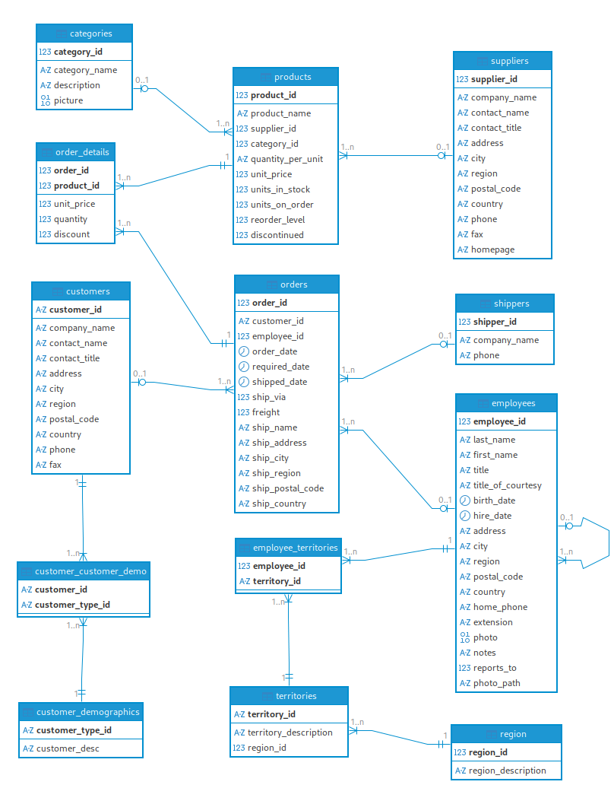

# Analyzing Northwind Database Using PostgreSQL
This repository contains a collection of SQL queries and views for analyzing the classic Northwind sample database using PostgreSQL.
The database can be found [here](https://github.com/pthom/northwind_psql). The picture below gives an overview of the northwind database.

